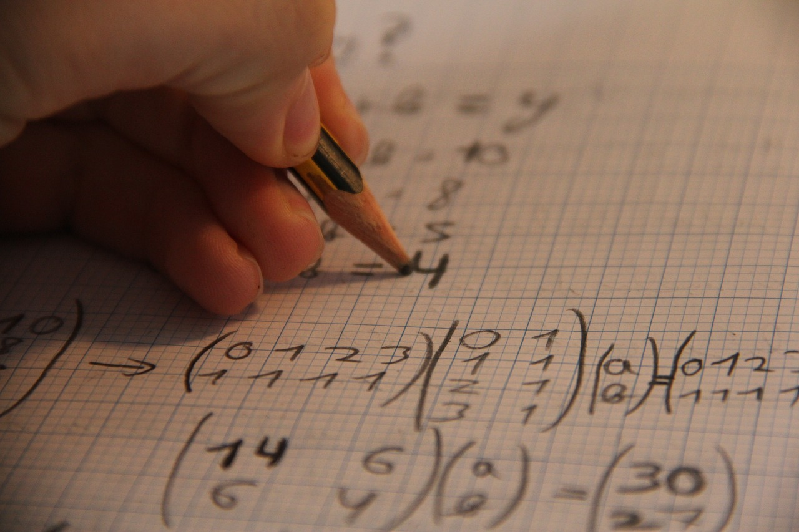

<h2 style="color: #173B72"> Understanding Electronics: Why Maths Matters </h2>
When I was in school, everything was a drag. I hated doing pages and pages of maths, but I loved to build things. The only way I could make a career from building things was by becoming good at maths and physics. What made it even worse was the fact that I didn't understand why we were doing it.

<!--  -->

Once I started working as an analog designer (electronic chip designer), I realized that I had to justify all my decisions so that other designers understood my designs. Some of this is through intuition and reasoning (explaining how circuits work using physics and increasing and decreasing quantities), but other parts are easier to explain using maths. We can use the same principles with regard to teaching and learning: if we understand why we are learning something and where it leads to in the future, we should end up actually understanding a topic rather than just memorising it and also have more motivation to learn.

The picture above is an excerpt from my work notebook showing an intuitive way of looking at a complex amplifier called a cascode. I start by increasing Vin and track all the changes that happen along the way to see what will happen at Vout. We can also see some simple maths next to the arrows that quantifies these changes. This will help us to convert our customer requirements into transistor parameters.

<!-- 
 -->
<h2 style="color: #173B72"> What is Electronics </h2>

The first question to answer is: what is electronics? The dictionary definition is a branch of physics that focuses on the design and operation of devices that manipulate electrons and other electrically charged particles. In reality, it is about making cool stuff that helps people.

These days, we’re surrounded by technology that would have seemed like science fiction just 50 years ago, yet only a small number of people really understand how it all works. Gaining that understanding often comes from a mix of reading, hands-on experience, and a bit of math to see where the equations lead us.

In electronics, we use maths to create models of our designs, which helps us estimate values that meet requirements. While these estimates might not be super precise, they give us insights into potential design flaws, ways to optimize our work, and whether our designs will function as we intended. Additionally, some math tools make our lives a lot easier. For instance, we use Laplace and Fourier transforms which simplify complex differential equations into polynomials, which are much easier to handle and still connect back to the real world.
<!-- 
 -->

<h2 style="color: #173B72"> Useful Maths Topics in Electronics </h2>

Here are some topics from A-level maths that I have used in my job and will talk about in more detail:

- Functions and Algebra
- Trigonometry
- Exponentials and Logarithms
- Differentiation and Integration
- Numerical Methods
- Vectors and Matrices
- Statistical Distributions
- Complex Numbers

<!-- This is meant to help 16-18 year olds understand where schoolwork is actually useful in real life. The style should be informal, but clarity is key. -->
