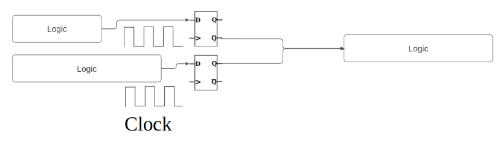

> ## Algebra and Quadratics TLDR
> - Algebra used everywhere in electronics - basic example is a clock generator 
>    - Uses capacitors (component that stores charge - similar to a battery) and transistors (voltage controlled current source). 
>    - Rearrange <math xmlns="http://www.w3.org/1998/Math/MathML">
  <mrow>
    <mi>I</mi>
    <mo>&#8290;</mo>
    <mi>t</mi>
    <mo>=</mo>
    <mi>C</mi>
    <mo>&#8290;</mo>
    <mi>V</mi>
  </mrow>
</math>
 (equation governing capacitor charging) into <math xmlns="http://www.w3.org/1998/Math/MathML">
  <mrow>
    <mi>f</mi>
    <mo>=</mo>
    <mfrac>
      <mi>I</mi>
      <mrow>
        <mi>C</mi>
        <mo>&#8290;</mo>
        <mi>V</mi>
      </mrow>
    </mfrac>
  </mrow>
</math>
 to determine clock frequency. Find values for I, C and V to give a specific frequency. Challenge is to achieve the required frequency with minimum current and minimum capacitor size.
> - Second example - algebra used for sizing transistors. 
>   - Can control how much current a transistor provides for a certain input voltage by changing transistor width and length. 
>   - Equation that models this is - <math xmlns="http://www.w3.org/1998/Math/MathML">
  <mrow>
    <mi>I</mi>
    <msub>
      <mi>d</mi>
      <mo>=</mo>
    </msub>
    <mo>&#8290;</mo>
    <mi>k</mi>
    <mo>&#8290;</mo>
    <mfrac>
      <mi>W</mi>
      <mi>L</mi>
    </mfrac>
    <mo>(</mo>
    <mrow>
      <mi>V</mi>
      <msub>
        <mi></mi>
        <mi>GS</mi>
      </msub>
      <mo>-</mo>
      <mi>V</mi>
      <msub>
        <mi></mi>
        <mi>th</mi>
      </msub>
    </mrow>
    <mo>)</mo>
    <msup>
      <mi></mi>
      <mn>2</mn>
    </msup>
  </mrow>
</math>
>   - W and L are width and length respectively.
>   - If you want 10uA when input is 2V then solve for <math xmlns="http://www.w3.org/1998/Math/MathML">
  <mfrac>
    <mi>W</mi>
    <mi>L</mi>
  </mfrac>
</math>
 when <math xmlns="http://www.w3.org/1998/Math/MathML">
  <mrow>
    <mn>10</mn>
    <mi>&#956;</mi>
    <mo>=</mo>
    <mfrac>
      <mrow>
        <mn>120</mn>
        <mi>&#956;</mi>
        <mo>&#8290;</mo>
        <mi>W</mi>
      </mrow>
      <mi>L</mi>
    </mfrac>
    <mo>(</mo>
    <mrow>
      <mn>2</mn>
      <mo>-</mo>
      <mn>0.7</mn>
    </mrow>
    <mo>)</mo>
    <msup>
      <mi></mi>
      <mn>2</mn>
    </msup>
  </mrow>
</math>
, have substituted in common values for k and Vth.
> - Resonators: Basis of how an antenna works. 
>   - Uses capacitors and inductors (stores current in a magnetic field) as their resistance is dependent on frequency. 
>   - Modelled using the equation <math xmlns="http://www.w3.org/1998/Math/MathML">
  <mfrac>
    <mn>1</mn>
    <mrow>
      <mo>(</mo>
      <mrow>
        <mi>L</mi>
        <mo>&#8290;</mo>
        <mi>C</mi>
        <mo>&#8290;</mo>
        <msup>
          <mi>s</mi>
          <mn>2</mn>
        </msup>
        <mo>+</mo>
        <mi>R</mi>
        <mo>&#8290;</mo>
        <mi>C</mi>
        <mo>&#8290;</mo>
        <mi>s</mi>
        <mo>+</mo>
        <mn>1</mn>
      </mrow>
      <mo>)</mo>
    </mrow>
  </mfrac>
</math>
. Can use discriminant on denominator to choose values of R, L, C so that circuit functions as a resonator.
> - Control Systems: These systems maintain desired outputs (like speed in cruise control) through negative feedback. 
>   - Roots of the system's transfer function (a quadratic equation) indicate stability. 
>   - Positive roots lead to instability
>   - Negative roots ensure the system settles at the desired value.

## Algebra
Algebra is one of the first things we learn in secondary school maths and it lays the groundwork for more advanced maths. Engineers often try to avoid pages of algebra and try to use logic and reasoning instead, but at a certain point we will need numbers. When designing a clock generator, I was always putting together simple algebraic equtions to give me a rough idea of what transistor values would give me maximum efficiency and minimum sizes. 

A clock is the heartbeat of a chip and helps us ensure that different processes happen in the right order. Unlike the clocks we use to tell time, a clock generator can be pretty simple — it just switches between on and off states. Each time it switches on, it triggers the next step in a sequence.

  <!-- needs some improvements -->
There are 2 logic paths on the left and they are merged into 1 on the right. If we did a direct connection then the shorter path would give us a result before the short path which could lead to incorrect values being outputted from the logic block on the right. We use latches or flip-flops to make sure that new values are not sent to the next logic block until the clock goes high where the clock frequency is set so that both logic paths have completed.

To create a clock with a specific frequency (how fast it turns on and off), we can use a capacitor. A capacitor acts like a battery; the more current you give it, the faster it charges. This behavior is described by the equation <math xmlns="http://www.w3.org/1998/Math/MathML">
  <mrow>
    <mi>I</mi>
    <mo>&#8290;</mo>
    <mi>t</mi>
    <mo>=</mo>
    <mi>C</mi>
    <mo>&#8290;</mo>
    <mi>V</mi>
  </mrow>
</math>
. We use a transistor to control the current going into the capacitor, which is modeled by another equation - <math xmlns="http://www.w3.org/1998/Math/MathML">
  <mrow>
    <mi>I</mi>
    <msub>
      <mi>d</mi>
      <mo>=</mo>
    </msub>
    <mo>&#8290;</mo>
    <mi>k</mi>
    <mo>&#8290;</mo>
    <mfrac>
      <mi>W</mi>
      <mi>L</mi>
    </mfrac>
    <mo>(</mo>
    <mrow>
      <mi>V</mi>
      <msub>
        <mi></mi>
        <mi>GS</mi>
      </msub>
      <mo>-</mo>
      <mi>V</mi>
      <msub>
        <mi></mi>
        <mi>th</mi>
      </msub>
    </mrow>
    <mo>)</mo>
    <msup>
      <mi></mi>
      <mn>2</mn>
    </msup>
  </mrow>
</math>

In reality, the capacitor is implemented using another transistor and the capacitance of a transistor is approximately <math xmlns="http://www.w3.org/1998/Math/MathML">
  <mrow>
    <mi>a</mi>
    <mo>&#8290;</mo>
    <mi>W</mi>
    <mo>&#8290;</mo>
    <mi>L</mi>
  </mrow>
</math>
.

When we put all these equations together, we find that if the capacitor and the transistor are the same type and size, changing their widths doesn’t affect the final clock frequency. This is great because we can use the lengths to set the frequency and the widths can be adjusted to minimize the impact of real life variations like noise. Noise is random fluctuations in current caused by the random movement of electrons that would mess with our clock frequency. 

  <!-- needs some improvements -->

## Quadratics
These come up when designing filters, antennas, control systems and all other kinds of things. 

Filters and Resonators
A filter is a component that stops signals of certain frequency from passing through. It is one of the most basic things in electronics and is used in everything from sound systems to 5G communication. . One common type is the low-pass filter, which allows low frequencies to pass while blocking higher ones. It’s made up of a resistor and a capacitor. At low frequencies, the capacitor resists current flow, so the output voltage is similar to the input. But as the frequency increases, the capacitor allows more current to pass, reducing the output voltage.

We can use the equations above to design a special type of filter called a resonator and this is the basic principle of how antennas work. When we connect  a resistor, capacitor and inductor in series, we see that energy will oscillate between the capacitor and the inductor. This is because the capacitor has to charge up before it can discharge through the inductor which then causes the inductor to charge up. When the input signal is at a specific frequency, the resistance of the capacitor and inductor is at a minimum which means that the current flowing through the circuit maximises and we get the graph below. 

Now this is where quadratics comes in, the equation modelling a resonator is given by <math xmlns="http://www.w3.org/1998/Math/MathML">
  <mfrac>
    <mn>1</mn>
    <mrow>
      <mo>(</mo>
      <mrow>
        <mi>L</mi>
        <mo>&#8290;</mo>
        <mi>C</mi>
        <mo>&#8290;</mo>
        <msup>
          <mi>s</mi>
          <mn>2</mn>
        </msup>
        <mo>+</mo>
        <mi>R</mi>
        <mo>&#8290;</mo>
        <mi>C</mi>
        <mo>&#8290;</mo>
        <mi>s</mi>
        <mo>+</mo>
        <mn>1</mn>
      </mrow>
      <mo>)</mo>
    </mrow>
  </mfrac>
</math>. 

We usually don't need to solve this equation, but the discriminant helps us determine if our circuit acts as a resonator or a bandpass filter. We know that our system has to oscillate for all of this to work which means that for our circuit to be a resonator, our discriminant must be less than 0. This comes from the fact that if the roots are complex then the system can oscillate but we won't go into too much detail about that for now. 

LC values are fixed for the frequency we want to transmit or receive as the resistance minimises when the capacitor and inductor have the same resistance so <math xmlns="http://www.w3.org/1998/Math/MathML">
  <mrow>
    <mi>L</mi>
    <mi>f</mi>
    <mo>=</mo>
    <mfrac>
      <mn>1</mn>
      <mrow>
        <mi>C</mi>
        <mi>f</mi>
      </mrow>
    </mfrac>
  </mrow>
  <mrow>
    <mo>&#8594;</mo> <!-- Right arrow -->
    <mi>f</mi>
    <mo>=</mo>
    <msqrt>
      <mfrac>
        <mn>1</mn>
        <mrow>
          <mi>L</mi>
          <mi>C</mi>
        </mrow>
      </mfrac>
    </msqrt>
  </mrow>
</math> so this means we can use the discriminant to get an upper bound for the resistor.

<math xmlns="http://www.w3.org/1998/Math/MathML">
  <mrow>
    <msup>
      <mi>R</mi>
      <mn>2</mn>
    </msup>
    <msup>
      <mi>C</mi>
      <mn>2</mn>
    </msup>
    <mo>&lt;</mo>
    <mn>4</mn>
    <mo>&#8290;</mo>
    <mi>L</mi>
    <mi>C</mi>
  </mrow>
  <mo>&rarr;</mo>
  <mrow>
    <mi>R</mi>
    <mo>&lt;</mo>
    <mn>2</mn>
    <msqrt>
      <mfrac>
        <mi>L</mi>
        <mi>C</mi>
      </mfrac>
    </msqrt>
  </mrow>
</math>
We can reduce this resistor if we want to transmit or receive a smaller number of frequencies (reduce our bandwidth) but have a much stronger signal for those frequencies (increase antenna range). For instance, if we were designing an antenna for satellite communication the frequency band is very small so we would want to reduce the resistor so that we get maximum range whereas bluetooth is very short range but we want high bandwidth as multiple devices might be connected to one mobile phone and then we can use different frequencies for separation.

<!-- *Bluetooth separation image* -->

Control Systems
This is the area where solving quadratics becomes useful. A control system are essential for ensuring that a system can maintain a specific output regardless of external conditions. A classic example of this is cruise control, where the car maintains a fixed speed. It does this by measuring the current speed of the car and then accelerating if the car is too slow or decelerating if the car is going too fast. This is called negative feedback where we detect the output, put it through another system and subtract it from the input so that the system reacts in the opposite direction to the current output.

Sometimes negative feedback can become positive feedback (subtracting a negative number is equivalent to an addition) and this causes a snowball effect where an increase in the input causes an increase in the output. We can use quadratics to prevent this from happening as control systems are modelled using something called transfer functions. When you multiply your transfer function and your input signal together, the output of the multiplication is approximately what you would get out of your control system.

Example Transfer function: <math xmlns="http://www.w3.org/1998/Math/MathML">
  <mrow>
    <mfrac>
      <mrow>
        <mi>KdKv</mi>
      </mrow>
      <mrow>
        <mrow>
          <msup>
            <mi>s</mi>
            <mn>2</mn>
          </msup>
          <mo>+</mo>
          <mi>fs</mi>
          <mo>+</mo>
          <mfrac>
            <mrow>
              <mi>KdKv</mi>
            </mrow>
            <mrow>
              <mi>f</mi>
            </mrow>
          </mfrac>
        </mrow>
      </mrow>
    </mfrac>
  </mrow>
</math>

When we solve this quadratic, we are actually finding the solutions of a differential equation. This means that if the roots are positive, then the system is unstable. The reason behind this is hard to explain at the moment as it requires understanding of complex numbers, differential equations and exponentials (negative roots correspond to decaying terms that settle to a certain value). 

We are going to go back to our clock generator example as we can use a control system there to ensure that our clock frequency stays constant. The clock generator control loop would be made up of 3 parts - a sensor, a filter and an oscillator. The sensor would compare the output frequency with the value we want and produce a voltage that is proportional to the difference between them. The filter would take the sensor output and remove any high frequency components that could cause instability and the oscillator would be the part we talked about in the algebra section which would produce a frequency proportional to the input voltage. All this comes together to give us the transfer function: 

We would then use the quadratic formula to find the roots of the denominator which gives - 
<math xmlns="http://www.w3.org/1998/Math/MathML">
  <mrow>
    <mo>-</mo>
    <mfrac>
      <mi>fc</mi>
      <mn> 2 </mn>
    </mfrac>
    <mo>&#177;</mo>
    <mfrac>
      <msqrt>
        <mrow>
          <msup>
            <mi>fc</mi>
            <mn>2</mn>
          </msup>
          <mo>-</mo>
          <mn>4</mn>
          <mi>Kd</mi>
          <mi>Kv</mi>
        </mrow>
      </msqrt>
      <mn>2</mn>
    </mfrac>
  </mrow>
</math> - which gives us the conditions that either <math xmlns="http://www.w3.org/1998/Math/MathML">
  <msup>
  <mi>fc</mi>
  <mn>2</mn>
  </msup>
  <mo>-</mo>
  <mn>4</mn>
  <mi>K</mi>
  <mo>_</mo>
  <mi>d</mi>
  <mo>&#8290;</mo>
  <mi>K</mi>
  <mo>_</mo>
  <mi>v</mi>
  <mo>&lt;</mo>
  <mn>0</mn>
</math>
, or <math xmlns="http://www.w3.org/1998/Math/MathML">
  <mrow>
    <mi>fc</mi>
    <mo>&gt;</mo>
    <msqrt>
      <mrow>
        <msup>
        <mi>fc</mi>
        <mn>2</mn>
        </msup>
        <mo>-</mo>
        <mn>4</mn>
        <mi>Kd</mi>
        <mi>Kv</mi>
      </mrow>
    </msqrt>
  </mrow>
  <mo>&rArr;</mo>
  <mrow>
    <mn>4</mn>
    <mi>Kd</mi>
    <mi>Kv</mi>
    <mo>&gt;</mo>
    <mn>0</mn>
  </mrow>
</math>
. In this specific case the second part is always going to be true so our system is always going to be stable but this might not always be the case.

### PS:
We actually have to multiply all our frequencies by <math xmlns="http://www.w3.org/1998/Math/MathML">
  <mrow>
    <mn>2</mn>
    <mo>&#x3C0;</mo> <!-- This is the Unicode character for pi -->
  </mrow>
</math> to get correct values. This is because when we differentiate and integrate sine and cosine terms the units have to be radians. To get a 10Hz sine wave, the expression would be sin(<math xmlns="http://www.w3.org/1998/Math/MathML">
  <mrow>
    <mn>20</mn>
    <mo>&#x3C0;</mo> <!-- This is the Unicode character for pi -->
  </mrow>
</math>) as 1 cycle corresponds to <math xmlns="http://www.w3.org/1998/Math/MathML">
  <mrow>
    <mn>2</mn>
    <mo>&#x3C0;</mo> <!-- This is the Unicode character for pi -->
  </mrow>
</math> radians and we want to fit 10 cycles into 1 second. This can be done by compressing the signal in time which corresponds to a division by 10 and since <math xmlns="http://www.w3.org/1998/Math/MathML">
  <mrow>
    <mi>time</mi>
    <mo>=</mo>
    <mfrac>
      <mn>1</mn>
      <mi>f</mi>
    </mfrac>
  </mrow>
</math>, our final equation would be sin(<math xmlns="http://www.w3.org/1998/Math/MathML">
  <mrow>
    <mn>2</mn>
    <mo>&#x3C0;</mo> <!-- This is the Unicode character for pi -->
    <mi>f</mi>
  </mrow>).

