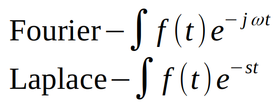
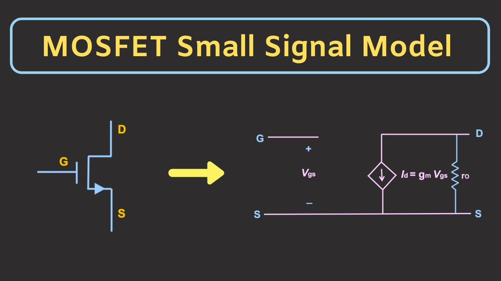
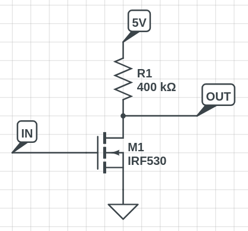
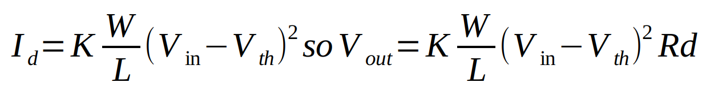
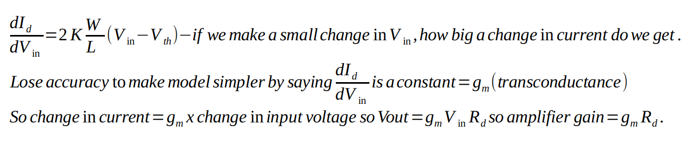

> ## Differentiation and Integration TLDR:
> - Understanding Circuit Dynamics
>   - In electronics engineering, circuits often involve second-order differential equations, as seen in resonators. 
>   - Using Kirchhoff's voltage law, we can express the relationship between voltages in a circuit. 
>   - For example, the equation <math xmlns="http://www.w3.org/1998/Math/MathML">
  <mrow>
    <mi>I</mi>
    <mi>R</mi>
    <mo>+</mo>
    <msub>
      <mi>C</mi>
      <mn>1</mn>
    </msub>
    <mo>&#8290;</mo> <!-- This is the multiplication dot -->
    <mo>&#x222B;</mo> <!-- Integral sign -->
    <mi>I</mi>
    <mo>d</mo>
    <mi>t</mi>
    <mo>+</mo>
    <mi>L</mi>
    <mo>&#8290;</mo> <!-- This is the multiplication dot -->
    <mfrac>
      <mi>di</mi>
      <mi>dt</mi>
    </mfrac>
  </mrow>
</math>
 ​= Supply Voltage can be differentiated to yield a standard second-order differential equation: <math xmlns="http://www.w3.org/1998/Math/MathML">
  <mrow>
    <mfrac>
      <mi>di</mi>
      <mi>dt</mi>
    </mfrac>
    <mi>R</mi>
    <mo>+</mo>
    <mi>C</mi>
    <mi>I</mi>
    <mo>+</mo>
    <mi>L</mi>
    <mfrac>
    <mrow>
      <msup>
        <mi>d</mi>
        <mn>2</mn>
      </msup>
      <mi>i</mi>
    </mrow>
      <mrow>
      <msup>
      <mi>dt</mi>
      <mi>2</mi>
      </msup>
      </mrow>
    </mfrac>
    <mo>=</mo>
    <mn>0</mn>
  </mrow>
</math>
>   - To simplify calculations, we use transforms like the Fourier and Laplace transforms, which allow us to work in the frequency domain and reduce the need for direct integration and differentiation.
>   - Fourier and Laplace transforms require us to integrate so inspection can only be used on common functions. If we come across a case where it is not easy to decompose the function into common functions then we will have to do the integration ourselves, but this tends to be rare.
> 
> - Modelling Transistors
>   - Transistors, particularly MOSFETs, are complex to model due to their multiple pins and interactions. 
>   - A common use of MOSFETs is for amplifier design, where we convert voltage signals into current and back to voltage to boost signals for transmission, improving the signal-to-noise ratio. 
>   - The governing equation for current in a MOSFET is <math xmlns="http://www.w3.org/1998/Math/MathML">
  <mrow>
    <mi>I</mi>
    <mo>=</mo>
      <mn>0.5</mn>
      <mi>K</mi>
    <mfrac>
      <mi>W</mi>
      <mi>L</mi>
    </mfrac>
    <mo>(</mo>
    <mrow>
    <msub>
      <mi>V</mi>
      <mi>in</mi>
    </msub>
    </mrow>
    <mo>-</mo>
    <msub>
      <mi>V</mi>
      <mi>th</mi>
    </msub>
    <msup>
      <mo>)</mo>
      <mn>2</mn>
    </msup>
  </mrow>
</math>
. By differentiating this equation, we can get a quantity called transconductance (gm) which we assume is a constant, simplifying our amplifier equation to Vout​=gm​Vin​Rd​, where amplifier gain is gm​Rd. 
>   - This linear approximation is valid for small input signals, providing a practical starting point for simulations in chip design. 
>   - The concept of transconductance extends to more complex amplifier configurations as well and can be found using the same differentiation technique.

## Understanding Circuit Dynamics
We try to avoid complicated differentials and integrals in electronics engineering but most circuits are some form of second order differential equation. We saw this without realising it when we were talking about the resonator. V = IR, <math xmlns="http://www.w3.org/1998/Math/MathML">
  <mrow>
    <mi>I</mi>
    <mo>=</mo>
    <mi>C</mi>
    <mo>&#8290;</mo> <!-- This is the multiplication sign -->
    <mfrac>
      <mi>dV</mi>
      <mi>dt</mi>
    </mfrac>
  </mrow>
</math>
, <math xmlns="http://www.w3.org/1998/Math/MathML">
  <mrow>
    <mi>V</mi>
    <mo>=</mo>
    <mi>L</mi>
    <mo>&#8290;</mo> <!-- This is the multiplication sign -->
    <mfrac>
      <mi>dI</mi>
      <mi>dt</mi>
    </mfrac>
  </mrow>
</math>. There is something called Kirchoffs voltage law that tells us that all voltages in a circuit must add up to the value that we put in. In our resonator case this means that each component has a voltage across it and if we add them all up, we get the supply voltage - <math xmlns="http://www.w3.org/1998/Math/MathML">
  <mrow>
    <mi>I</mi>
    <mi>R</mi>
    <mo>+</mo>
    <msub>
      <mi>C</mi>
      <mn>1</mn>
    </msub>
    <mo>&#8290;</mo> <!-- This is the multiplication dot -->
    <mo>&#x222B;</mo> <!-- Integral sign -->
    <mi>I</mi>
    <mo>d</mo>
    <mi>t</mi>
    <mo>+</mo>
    <mi>L</mi>
    <mo>&#8290;</mo> <!-- This is the multiplication dot -->
    <mfrac>
      <mi>di</mi>
      <mi>dt</mi>
    </mfrac>
  </mrow>
</math>
 ​= Supply Voltage.  
If we differentiate everything to give <math xmlns="http://www.w3.org/1998/Math/MathML">
  <mrow>
    <mfrac>
      <mi>di</mi>
      <mi>dt</mi>
    </mfrac>
    <mi>R</mi>
    <mo>+</mo>
    <mi>C</mi>
    <mi>I</mi>
    <mo>+</mo>
    <mi>L</mi>
    <mfrac>
    <mrow>
      <msup>
        <mi>d</mi>
        <mn>2</mn>
      </msup>
      <mi>i</mi>
    </mrow>
      <mrow>
      <msup>
      <mi>dt</mi>
      <mi>2</mi>
      </msup>
      </mrow>
    </mfrac>
    <mo>=</mo>
    <mn>0</mn>
  </mrow>
</math>. This is now in the form of a standard second-order differential equation. 

We can make the maths easier by using transforms like the Fourier transform from the trigonometry section or another common transform called the Laplace transform which converts this differential equation into the quadratic equation we saw in the Algebra section. The equations for the Fourier and Laplace transforms are:

We do have to be able to do integrals but it will get to a point where you are transforming and inverting solely by inspection. For example <math xmlns="http://www.w3.org/1998/Math/MathML">
  <mfrac>
    <mi>di</mi>
    <mi>dt</mi>
  </mfrac>
</math>
 in the laplace domain is just sI(s) and <math xmlns="http://www.w3.org/1998/Math/MathML">
  <mfrac>
  <mrow>
  <msup>
    <mi>d</mi>
    <mn>2</mn>
  </msup>
  <mi>i</mi>
  </mrow>
  <mrow>
  <mi>d</mi>
  <msup>
  <mi>t</mi>
    <mn>2</mn>
  </msup>
  </mrow>
  </mfrac>
</math>
 is <math xmlns="http://www.w3.org/1998/Math/MathML"><msup><mi>s</mi><mn>2</mn></msup></math>I(s) so we can see that we get the quadratic from before which we can then use to find the values that we are looking for.

This example demonstrates that most of the time we need differential equations to model our circuits but we then use certain techniques to reduce the actual amount of integration and differentiation that we have to do on the job. 

## Modelling transistors

Image from https://www.youtube.com/@ALLABOUTELECTRONICS

There is a common case where we tend to do a bit of differentiation and that is when were are working with transistors. Transistors are extremely complex to model as there are many different effects going on within them. MOSFETs (a certain kind of transistor) have 4 pins and the voltages between those 4 pins can affect how it works. 

An extremely common circuit that we have to design is an amplifier which is used to boost a signal before we transmit it via an antenna. As we saw with the resonator, it can also pick up other frequencies which can mess up the signal that we want to pickup, by amplfiying the signal we are increasing the power of the signal so the interfering signals don't cause as much of an issue and the message is still readable. The proper name for this is improving the signal to noise ratio. The amplifier circuit works by turning our voltage signal into a current and then turning that current into a voltage via the resistor and we get a boosted signal out the other end. The equations governing this are:

The Vout equation isn't that great for us if we want to compare different topologies so we differentiate the Id equation to give 

If we substitute <math xmlns="http://www.w3.org/1998/Math/MathML">
  <mrow>
    <mfrac>
      <mrow>
        <mn>2</mn>
        <mi>K</mi>
        <mi>W</mi>
      </mrow>
      <mi>L</mi>
    </mfrac>
    <mo>(</mo>
    <mrow>
      <msub>
        <mi>V</mi>
        <mi>in</mi>
      </msub>
      <mo>-</mo>
      <msub>
        <mi>V</mi>
        <mi>th</mi>
      </msub>
    </mrow>
    <mo>)</mo>
  </mrow>
</math>
for gm we wouldn't get the same equation for Vout that we had before. However, what we find is that the input signal tends to be quite small (if it was large, wouldn't need to amplify) so the inaccuracy that comes from using a linear approximation for a quadratic function also tends to be quite small. We have to remember that these calculations are not the final values going into the chip, we will only be using these numbers as a starting point so that we are not aimlessly putting values into the simulator. 

This concept of amplifier gain being gmRd also extends to more complicated amplifiers and we can use the same steps of differentiating current with respect to input voltage to find equivalent gm or Gm which is the transconductance of a group of transistors.