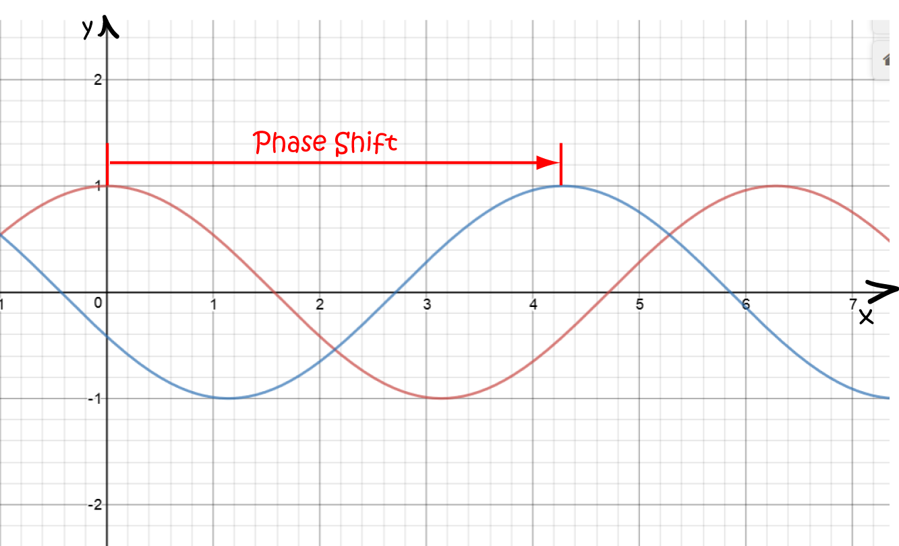

> ## Complex Numbers TLDR:
> - Impedance in Circuits: In resonators, the resistance of capacitors and inductors is represented as imaginary impedances: <math xmlns="http://www.w3.org/1998/Math/MathML">
  <mfrac>
    <mn>1</mn>
    <mrow>
      <mi>j</mi>
      <mo>&#8290;</mo> <!-- This is the multiplication sign -->
      <mi>&omega;</mi>
      <mo>&#8290;</mo> <!-- This is the multiplication sign -->
      <mi>C</mi>
    </mrow>
  </mfrac>
</math>
 for capacitors and jωL for inductors, where j is the imaginary unit and ω is the angular frequency. This reflects both the attenuation of signals and the introduction of phase (time) shifts.
>   - Phase Shifts: Capacitors cause a -90° phase shift (voltage lags current), while inductors cause a +90° phase shift (voltage leads current). Ignoring these phase shifts can lead to destructive interference in signals which is normally a problem but can be used to make noise-canceling headphones.
> - Fourier Transform: The Fourier transform breaks down signals into sines and cosines, which can be represented using the complex exponential <math xmlns="http://www.w3.org/1998/Math/MathML">
  <msup>
    <mi>e</mi>
    <mrow>
      <mo>-</mo>
      <mi>j</mi>
      <mo>&#8290;</mo>
      <mi>&omega;</mi>
      <mo>&#8290;</mo>
      <mi>t</mi>
    </mrow>
  </msup>
</math>
. Integrating this product with a signal helps measure the presence of different frequencies, similar to a dot product in vectors.
> - Laplace Transform and Stability: The Laplace transform extends the Fourier transform by incorporating exponentials. It allows us to analyze system stability as <math xmlns="http://www.w3.org/1998/Math/MathML">
  <mrow>
    <msup>
      <mi>e</mi>
      <mi>at</mi>
    </msup>
    <mo>&rarr;</mo>
    <mfrac>
      <mn>1</mn>
      <mrow>
        <mi>s</mi>
        <mo>-</mo>
        <mi>a</mi>
      </mrow>
    </mfrac>
  </mrow>
</math>
 so:
>   - Real roots indicate decaying or increasing exponentials.
>   - Imaginary roots correspond to oscillations (sine and cosine).
>   - Complex roots represent decaying or increasing sine terms.
> - A system is stable if the roots have a negative real part (exponential decay) and unstable if they have a positive real part (exponential growth).

There have been many cases where I have said that we require understanding of complex numbers to understand why something works the way it does. It came up when we were going through quadratics, fourier transforms and exponentials.

## Modelling Capacitors and Inductors Correctly
The first time I mentioned complex numbers, it was to do with resonators. I said that the resistance of a capacitor and inductor is <math xmlns="http://www.w3.org/1998/Math/MathML">
  <mfrac>
    <mn>1</mn>
    <mrow>
      <mi>C</mi>
      <mo>&#8290;</mo> <!-- This is the multiplication sign -->
      <mi>f</mi>
    </mrow>
  </mfrac>
</math> and Lf respectively, where f is frequency. This isn't exactly true, the actual resistances are <math xmlns="http://www.w3.org/1998/Math/MathML">
  <mfrac>
    <mn>1</mn>
    <mrow>
      <mi>j</mi>
      <mo>&#8290;</mo> <!-- This is the multiplication sign -->
      <mi>&omega;</mi>
      <mo>&#8290;</mo> <!-- This is the multiplication sign -->
      <mi>C</mi>
    </mrow>
  </mfrac>
</math> and jωL which means that they are imaginary. Because of this, we stop calling them resistances and call them impedances instead. In this case, j is the imaginary unit <math xmlns="http://www.w3.org/1998/Math/MathML">
  <msqrt>
    <mn>-1</mn>
  </msqrt>
</math>
 and w is the angular frequency. This impedance is imaginary because the capacitor and inductor not only attenuate the signal (change the magnitude) but they can also introduce phase shifts (time shifts) into the signal. When you put current into an capacitor, the voltage is actually a quarter period behind the current which corresponds to a phase shift of -90 degrees. Another way of thinking about this is that if we put a sine wave current into the capacitor, the capacitor essentially integrates the current so the voltage is -cos which is -90 degrees phase shift. The opposite thing happens with inductors as the current is differentiated to give the voltage so a sine wave becomes cos which is a +90 phase shift. 

Image from https://silopepic.weebly.com/phase-shift.html

As we know from the trigonometry section, this is all the basis of how electronic communication works so it is very common to be putting a sine or cos wave through an inductor or capacitor so if we do not take these phase shifts into account, it can lead to destructive interference as the signals can become 180 degrees out of phase, they will cancel each other out when they come together. We can think about this using sound. A sound wave is the oscillation of air molecules. If a speaker is playing one wave, we can play the same wave phase shifted by 180 degrees to apply an opposing force to these air molecules and stop them from moving at all. This is actually how noise cancelling headphones work. They record the noise around them, fourier transform it to find the loudest frequencies and play a phase shifted version of those frequencies to reduce the sound levels around the person.

## Fourier Transform and Control Systems Again
Now that we have some knowledge of complex numbers, we can go deeper into the fourier transform. We have previously talked about how this can break down a signal into sines and cosines of different frequencies. We can use complex numbers to package these sines and cosines into one term - <math xmlns="http://www.w3.org/1998/Math/MathML">
  <msup>
    <mi>e</mi>
    <mrow>
      <mo>-</mo>
      <mi>j</mi>
      <mo>&#8290;</mo>
      <mi>&omega;</mi>
      <mo>&#8290;</mo>
      <mi>t</mi>
    </mrow>
  </msup>
</math> which corresponds to <math xmlns="http://www.w3.org/1998/Math/MathML">
  <mrow>
    <mi>cos</mi>
    <mo>(</mo>
    <mi>w</mi>
    <mo>&#8290;</mo>
    <mi>t</mi>
    <mo>)</mo>
    <mo>-</mo>
    <mi>j</mi>
    <mo>&#8290;</mo>
    <mi>sin</mi>
    <mo>(</mo>
    <mi>w</mi>
    <mo>&#8290;</mo>
    <mi>t</mi>
    <mo>)</mo>
  </mrow>
</math>
. If we multiply this exponential by the signal and integrate with respect to time, we are essentially measuring how much of each frequency is within the signal. If the signal matches a particular frequency, the integral will be high which is similar to computing a dot product and also aligns well with the fact that sines and cosines can represent an abstract space the similar to how x and y do. 

We have already talked about why this is useful in the trigonometry section but this leads on well to explaining why this can determine if a control system is stable. We can make a modification to the fourier transform called the laplace transform which allows us to decompose a signal into sines and cosines as well as exponentials. <math xmlns="http://www.w3.org/1998/Math/MathML">
  <mrow>
    <msup>
      <mi>e</mi>
      <mi>at</mi>
    </msup>
    <mo>&rarr;</mo>
    <mfrac>
      <mn>1</mn>
      <mrow>
        <mi>s</mi>
        <mo>-</mo>
        <mi>a</mi>
      </mrow>
    </mfrac>
  </mrow>
</math> which means that:
 - Real roots correspond to a decaying or increasing exponential
 - Imaginary roots correspond to solely sine and cosine terms - an oscillator 
 - Complex roots correspond to decaying or increasing sine terms.

 This is why a negative real part means that the system is stable as the exponential term is decaying if the roots have negative real part and is unstable when the roots have positive real part as the exponential causes the system output value to go to its maximum value. 